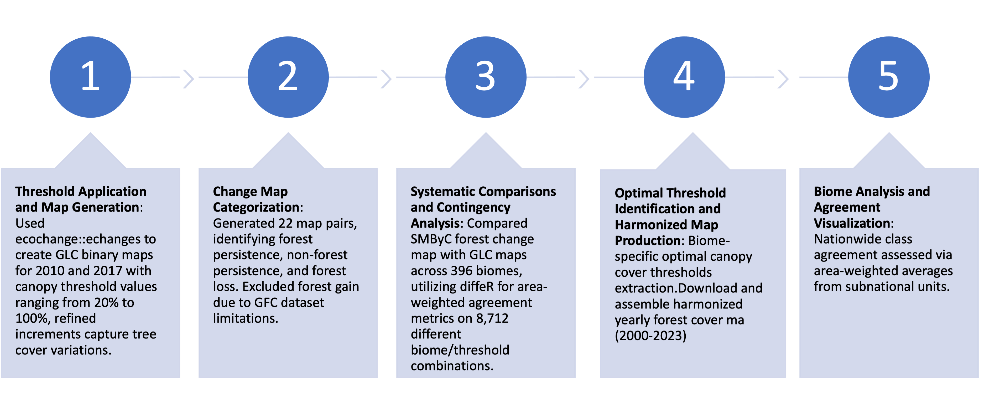
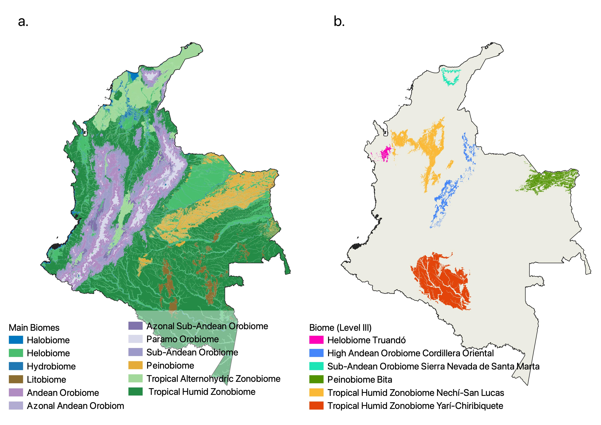
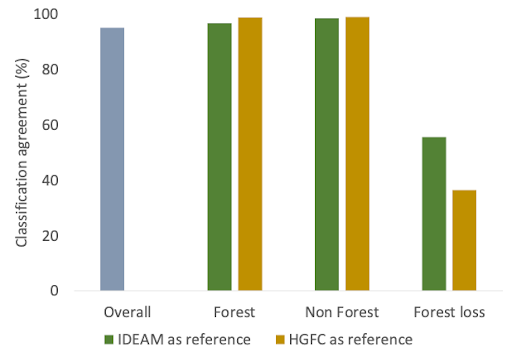

# Harmonization of Global and National Forest Cover Products

**A goal of large-area land cover mapping is to produce globally
consistent characterizations that have local relevance and utility; that
is, reliable information across scales.** (Hansen et al 2013)

This package allows to obtain yearly forest cover maps from the Global
Forest Cover dataset by Hansen et al (2013) and run a pixelwise
comparison with Colombian Forest Cover Datasets produced by the
**Forests and Carbon Monitoring System - SMBYC** at the National
Institute for Meteorology and Environmental Studies (IDEAM).

## Installation

You can install the development version of LCoverFlow from
[GitHub](https://github.com/) with:

``` r
# install.packages("devtools")
devtools::install_github("RSENSUS/harmonizacion_hansenIdeam")
```

# Introduction

## Objectives

### Main

1.  Assess the level of agreement between forest cover products by
    iteratively comparing multiple canopy cover for GLAD forest products
    with the national forest cover assessment
2.  Identify the threshold that produces the highest level of overall
    agreement between both datasets
3.  Perform the process for ecologically homogeneous spatial units.

### Specific:

1.  Fill spatial and temporal gaps in national forest coverage
    reporting, but homogenized to the national standards. Reduce costs
    and improve update frequency .

2.  Use local experience and locally produced datasets as validation
    data.

3.  Identify assess over/sub register of forest coverage/forest loss in
    the national and global datasets.

## Study Area

Continental extent of Colombia, divided in 379 spatial units (biomes).
(Londoño et al, 2017)

## IDEAM Forest Cover Data

National data on forest cover and change for Colombia (IDEAM) The Forest
and Carbon Monitoring System (*Sistema de Monitoreo de Bosques y
Carbono*) ascribed to IDEAM in Colombia (Table 1) produces the official
datasets on forest cover and change for the country and is the reference
for national and regional policy (DNP, 2020) and to fulfill Colombia’s
international reporting obligations (IDEAM, 2019). The forest cover
product represents forest presence in areas where vegetation meets the
national definition of forests (Table 2). This dataset explicitly
excludes commercial forestry, oil palm, and trees intended for
agricultural use (Galindo et al., 2014a,b).

Forest change is detected through a Principal Component Analysis of
merged data of end and start years. Forest change maps are produced
first by overlaying the maps representing forest cover as described
above. These maps then are subjected to a quality control process that
consists of manual reclassification of mistaken pixels based on visual
interpretation of the last available images for the year (IDEAM, 2019).
Any pixels with low quality observations due mostly to the presence of
clouds or cloud shadows in at least one of the mapped years are removed
from the analysis of forest loss in the entire time series. Maps were
produced at irregular intervals for the years 1990, 2000, 2005 and 2010
and annually from 2012 onwards. The IDEAM national forest change data is
the reference source to produce the official national report of annual
rates of forest loss and therefore it was used for comparing estimates
of forest cover loss with the GFC product. For change between 2012-2013
we used V5, for 2013-2014 we used V6, for 2014-2015, 2015-2016 , and
2016-2017 we used V7, and for 2017-2018, and 2018-19 we used V8. We used
Magna-Sirgas as the coordinate system for map comparison, given that
this is the official reference coordinate system for Colombia.

## Global Forest Cover Change Data(GFC) GLAD-UMD

The High-Resolution Global Maps of 21st-Century Forest Cover Change
(GFC- Table 1) is produced by the Group on Land Analysis and Discovery
(GLAD) at the University of Maryland (Hansen et al., 2013). GFC
harmonizes all available spectral data from the Landsat mission to
derive descriptive annual and semi-annual statistics (median, maximum,
minimum, and quantiles) for each spectral band that constitutes data
inputs to produce annual forest loss estimates through the application
of a supervised decision tree classifier. The final GFC product is
constituted by two main data sets. Pixel values for the first one
represent the percentage canopy cover in the first year of analysis
(2000). The second layer, assigns a value representing the year of
forest cover loss to all pixels that were mapped with a tree cover
higher than 30% in the reference year (2000). This layer enables users
to define forest extent in terms of a minimum percent tree cover
threshold. This threshold can be used to produce a mask of forest cover
for the initial year with a tree cover above the user-specified
threshold. This mask can then be applied to the layer on forest loss
year to remove pixels labeled as loss that are under the defined tree
cover threshold (Hansen et al 2013).

# Comparison of GLAD and SMBYC Datasets

This table provides a comparison between the GLAD and SMBYC datasets
used for land cover analysis.

| Criteria           | IDEAM                                                                                                                              | GLAD                                                                                                                  |
|--------------------|------------------------------------------------------------------------------------------------------------------------------------|-----------------------------------------------------------------------------------------------------------------------|
| Spatial Resolution | 30m                                                                                                                                | 30m                                                                                                                   |
| Base Information   | Landsat                                                                                                                            | Landsat                                                                                                               |
| Coverage           | National                                                                                                                           | Global                                                                                                                |
| Frequency          | Irregular                                                                                                                          | Annual                                                                                                                |
| Years              | 1990, 2000, 2005, 2010, 2012, 2013, 2014, 2015, 2016, 2017, 2018, 2019                                                             | 2000-2020                                                                                                             |
| Strengths          | \- Distinguishes between planted and natural forests<br>- Official information used to measure and report forest cover in Colombia | \- Higher temporal resolution<br>- Less data loss<br>- Annual updates<br>- Multiple canopy cover thresholds available |
| Weaknesses         | \- Maps produced at irregular intervals<br>- Multiple sources of data loss (SLC-off and cloudiness)                                | \- Does not distinguish between planted and natural forests<br>- Does not report forest gain                          |

# Methods

## 1. Extraction of Oprimal Canopy Thresholds

<figure>

<figcaption aria-hidden="true">Armonization Workflow</figcaption>
</figure>

Harmonization consisted of the production of forest cover maps from GFC
that best match the representation of forest cover and change by IDEAM
(Fig. 1) and that we refer here as HGFC. The first step was to exclude
from the class forest in GFC, pixels representing canopy forming
cultivation such as oil palm cultivation and agroforestry systems that
are explicitly excluded from the definition of forest used for IDEAM. We
eliminated those pixels based on areas representing canopy forming
cultivation in the national land cover maps for 2012 and 2017 (IDEAM,
2010 - Table 1), which are the closest dates to the period of analysis.

The second step was to produce a map representing three categories:
forest persistence, non forest persistence and forest loss between 2010
and 2017 using the forest non-forest maps produced by IDEAM for those
years. We selected 2010 as the first year because it is when the IDEAM
maps started to be produced at a higher temporal resolution. We selected
2017 as the last year because that was the latest year available for
IDEAM maps at the start of this research. We produced analogous maps
from GFC assuming different minimum thresholds in percent tree cover
that define forest and non-forest in GFC and used them to identify the
threshold that maximized agreement with the map produced from IDEAM.
Thresholds ranged between 20 and 100%. Thresholds increased by 10% for
values between 20% and 50%, 5% between 50% and 90%, and 1% between 90%
and 100%. Finer increments at higher percent tree cover values ensure
precision in these ranges, where most of the variation in percent tree
cover occurs in the GFC dataset. Forest gain was not considered in the
analysis because this data is not available for most years in the GFC
product.

To account for possible spatial variations in optimal percent tree cover
thresholds within the country, we performed the above described analysis
independently for each of the 396 geographic subunits representing areas
with homogeneous ecological conditions (Table 1). Data downloading and
thresholding was produced using the R package ‘ecochange’ (Lara et. al,
2022). For each subunit, we calculated overall agreement between the
change map calculated from IDEAM and each thresholded forest change map
calculated from GFC and selected the one that produced the maximum
overall agreement for further analysis. We used the optimum percent tree
cover thresholds identified for each subunit to derive harmonized maps
representing forest cover for the years 2012 to 2021 for the entire
country. These maps were used to evaluate class agreement between the
maps and to compare estimates of annual forest loss derived from HGFC
and IDEAM. Overall class agreement for the entire country was calculated
as the area weighted average of the agreements obtained in all
subnational units.




 \## 2. Obtention of yearly harmonized forest
cover maps

The optimized canopy cover threshold for each biome are then used to
obtain yearly forest cover maps individually, using the the echanges
function again. The procedure has been optimized to run iteratively over
the all the individual spatial units. Memory load issues require to
divide the download process into smaller subsets and temporarily store
the outputs. Next step include reprojecting and aligning the outputs to
a common src and assembling the final yearly maps.

<figure>

<figcaption aria-hidden="true">Area weighted agreement assessment
between change maps derived from IDEAM and Harmonized GFC maps for the
categories non-forest, forest, and forest loss.</figcaption>
</figure>

## Funding

This work was supported by [The National Aeronautics and Space
Administration - NASA](https://cce.nasa.gov/cce/about.htm?), [Award
80NSSC18K0339](https://cce.nasa.gov/cgi-bin/cce/cce_awards.pl?projType=project&progID=1&projID=3863).

### Publications:

Lara, W., Londoño, M.C., Gonzalez, I. and Gutierrez‐Velez, V.H., 2022.
ecochange: An R‐package to derive ecosystem change indicators from
freely available earth observation products. Methods in Ecology and
Evolution, 13(11), pp.2379-2388.

**Gutierrez-Velez VH**, Rodriguez-Escobar J, Mejía A†, Espejo J, Anaya
JA, Blair, ME. Under review. Mapping forest cover and change as
continuous variables is essential to advance consistency across forest
monitoring products.

### References

Hansen, M. C., Potapov, P. V., Moore, R., Hancher, M., Turubanova, S.
A., Tyukavina, A., Thau, D., Stehman, S. V., Goetz, S. J., Loveland, T.
R., Kommareddy, A., Egorov, A., Chini, L., Justice, C. O., & Townshend,
J. R. G. (2013). High-Resolution Global Maps of 21st-Century Forest
Cover Change. Science, 342(6160), 850–853.
<https://doi.org/10.1126/science.1244693>

Galindo, G., Espejo, O. J., Ramírez, J. P., Forero, C., Valbuena, C. A.,
Rubiano, J. C., Lozano, R. H., Vargas, K. M., Palacios, A., Palacios,
S., Franco, C. A., Granados, E. I., Vergara, L. K., & Cabrera, E.
(2014). Memoria Técnica. Cuantificación de la Superficie de Bosque
Natural y Deforestación a Nivel Nacional Actualización Periodo 2012 –
2013 \[Technical Report\]. IDEAM.
